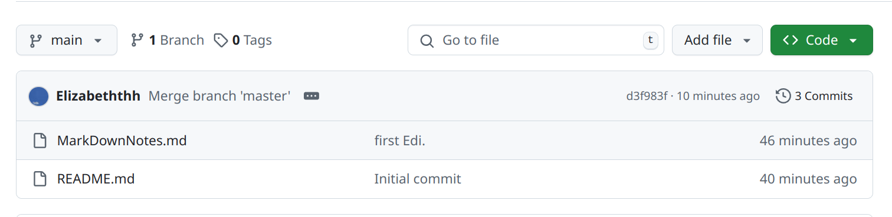
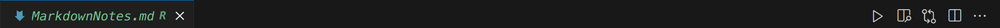
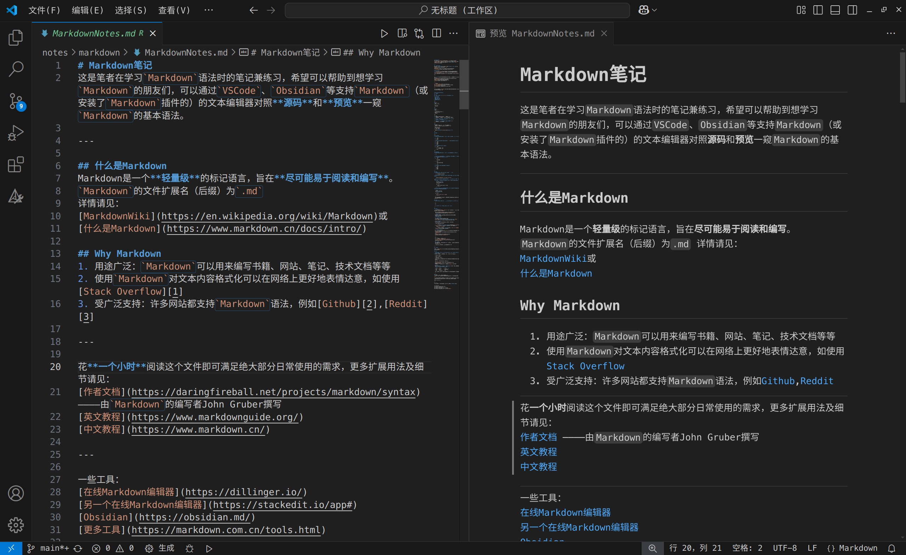
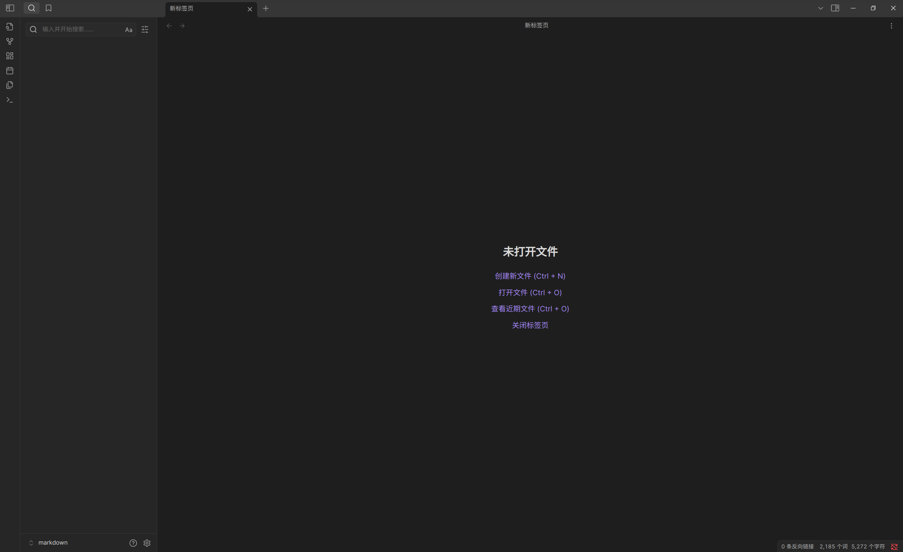
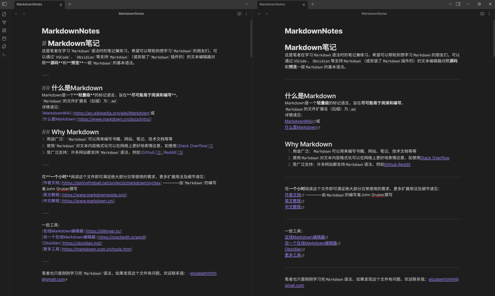

# MarkdownNotes

## 请使用支持`Markdown`的文本编辑器如[VSCode][1]、[Obsidian][2]打开

点击右上角的`Code`->`Download Zip`即可下载

1. `VSCode`打开`MarkdownNotes.md`
   
   点击**播放键**左边的**预览**即可
   界面如下
   

---

2. `Obsidian`打开`MarkdownNotes.md`  
     
   
   点击`打开文件`，找到你下载的`MarkdownNotes.md`文件
   点击右上方的`更多选项`->`左右分屏`，在左边的分屏点击`更多选项`->`源码模式`即可
   

[1]:<https://code.visualstudio.com/>
[2]:<https://obsidian.md/>

